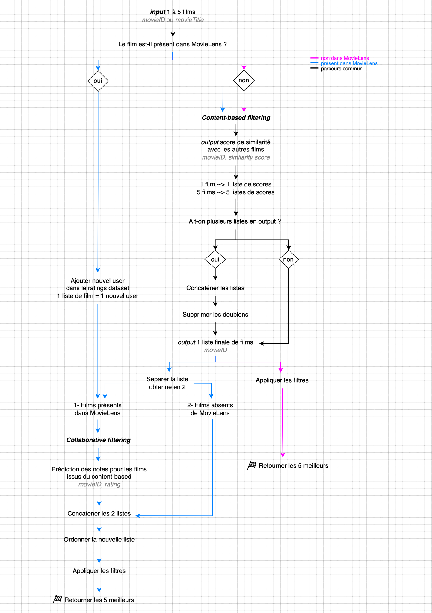
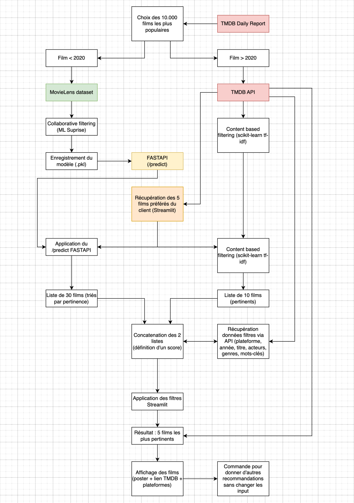

# Movie Matcher
<p align="center">
    
</p>

## Présentation

Découvrez une expérience cinématographique personnalisée avec Movie Matcher, notre **moteur de recommandation de films** intégré à Streamlit. Sélectionnez entre 1 et 5 films que vous avez appréciés, et laissez notre modèle de machine learning utiliser à la fois le filtrage collaboratif et le contenu pour vous suggérer des films similaires. 

Explorez des recommandations adaptées à vos goûts, et obtenez des informations détaillées sur la disponibilité des films sur différentes plateformes avec abonnement.

Utilisez des filtres avancés tels que mots-clés, genres, acteurs, réalisateurs, année, et plateformes de streaming pour affiner vos choix et trouver votre prochaine pépite cinématographique.


# Machine learning

## Schéma général

Notre moteur de recommandation de films s'appuie sur deux approches : le filtrage collaboratif et le filtrage par contenu. Autrement dit, les recommandations sont effectuées à partir du calcul de similarité entre les films et entre les profils utilisateurs.

<p align="center">
    
</p>

## Données

Nos données proviennent de deux sources principales : 
1) L'API TMDB : pour les informations sur le synopsis, les genres, le casting, le réalisateur, les mots-clés, etc.
2) La base de données MovieLens.org : pour les notes des utilisateurs.

## Modèle hybride

Voici un schéma du fonctionnement de notre moteur de recommandation hybride :

<p align="center">
    
</p>

## Algorithmes et outils

Pour réaliser le filtrage par contenu, nous avons utilisé les outils de la librairie Scikit-Learn : matrice TF-idf et calcul de similarité cosinus.

Pour réaliser le filtrage collaboratif, nous avons utilisé la librairie Surprise et l'algorithme SVD.

## Comparatifs des algorithmes 

Nous avons testé les différents algorithmes de la librairie Surprise et avons retenu celui ayant les meilleures performances en termes de précision et de temps de calcul.

La performance est mesurée avec les métriques MAE et RMSE qui calculent l'écart entre la prédiction et la valeur réelle.

Le tableau ci-dessous résume les scores des différents algorithmes testés :

<p align="center">
    
</p>

*Lecture :*
- *En rouge : les scores les moins bons et non adaptés à notre besoin.*
- *Une MAE de 0.60 indique un écart de 0.60 points entre la prédiction et la note réelle.*
- *L'écart permet de mettre en évidence les éventuels cas de sur-apprentissage (overfitting).*

## Nos formules mathématiques

Pour une question de ressources et de temps, nous devions réduire la taille de notre base de données de films. Pour ce faire, nous avons utilisé la formule du score IMDB pour sélectionner les films à retenir.

Pour obtenir la recommandation finale, nous appliquons un calcul sur les résultats des deux approches de filtrage. Le calcul du score final est détaillé ci-dessous.

1) Formule du score IMDB (ou weighted IMDB ratings) :

    Cette formule de score IMDB permet d'appliquer un score selon des critères. Cette formule a été développé

    $\text{Score IMDB} = \frac{R \cdot v + C \cdot M}{v + m}$
    
    **Où :**
    - $v$ est le nombre de votes pour le film
    - $m$ est le nombre minimum de votes requis pour figurer dans le classement
    - $R$ est la note moyenne du film
    - $C$ est la moyenne des votes au global

<br>

2) Formule du **score hybride Movie Matcher** :

    $Score_{film} = w_{CF} * S_{CF} + w_{CB} * (\frac{\sum_{i=1}^{n} S_{CB_i}}{n} + \alpha * n)$

    **Où :**
    - $w_{CF}$ est le poids pour le modèle de filtrage collaboratif,
    - $S_{CF}$ est la note prédite (si le film n'est pas présent dans le modèle de filtrage collaboratif, vous pouvez utiliser la moyenne des scores comme valeur par défaut),
    - $w_{CB}$ est le poids pour le modèle content-based,
    - $S_{CB_i}$ est le score de similarité content-based pour la \(i\)-ième occurrence du film,
    - $n$ est le nombre d'occurrences du film dans les prédictions du modèle content-based,
    - $\alpha$ est un paramètre de réglage.

<br>

# Architecture

## Stack technique

Nous utilisons **FastAPI** pour exécuter notre modèle de machine learning et récupérer les prédictions.
L'interface utilisateur est réalisée avec la librairie **Streamlit**. 
Enfin, notre application est *Dockerisée* et déployée avec **Heroku**.

Voici un schéma de l'architecture de notre application :

<p align="center">
    
</p>

<p align="center"><i>Schéma réalisé par Clément B.</i></p>

<br>

---

## Clone

```$ git clone https://github.com/thimyxuan/movie-recommender-app.git```

## Déploiement local

Si vous souhaitez déployer l'application en local, vous pouvez choisir parmi une des étapes suivantes :

1) Déployer Streamlit + FastAPI

    Il faut simplement lancer la commande `docker-compose up`

    Les sites seront accessibles aux liens :

    - [Streamlit](http://localhost:8501) : `http://localhost:8501`

    - [FastAPI](http://localhost:4000/docs) : `http://localhost:4000`

2) Déployer Streamlit uniquement

    Il faut lancer les 2 commandes suivantes :

    - Construire l'image : `docker build -t movie-matcher-streamlit`

    - Construire le container : `docker run -it -v "$(pwd):/home/app" -p 8501:8501 movie-matcher-streamlit`

    Le streamlit sera accessible au lien :

    [Streamlit](http://localhost:8501) : `http://localhost:8501`

3) Déployer FastAPI uniquement

    README disponible dans le dossier suivant : [/fastapi](fastapi)


## Scripts

Les scripts sont utilisés pour générer les fichiers nécessaire au fonctionnement du dashboard et de l'API. Ils sont disponibles au répertoire `scripts/`

1) `scripts/script_tmdb_api.py` : connexion à l'API de TMDB, téléchargement des 20.000 films les plus populaires. Récupération de toutes les données importantes et création des fichiers `fastapi/src/TMDB_content.csv` et `fastapi/src/TMDB_providers.csv`

2) `scripts/script_imdb_rating.py` : téléchargement des fichiers MovieMatcher, application de la formule du score IMDB et du filtre sur les films, mise à jour du fichier `fastapi/src/TMDB_content.csv` puis création du fichier `fastapi/src/Movielens_ratings_updated.csv` pour le filtrage collaboratif.

3) `scripts/script_tmdb_content_based.py` : application du machine learning (matrice TF-IDF, similarité cosinus), puis création du fichier `fastapi/src/TMDB_content_based.csv`

<br>
<br>

**Crédits : Ce projet est un travail de groupe réalisé en collaboration avec Clément B. et Yann S. dans le cadre de la formation Full-Stack Data Scientist de l'école Jedha.*